# COMPREHENSIVE ARCHITECTURE DESIGN HANDBOOK (FINAL VERSION)

This document is the fully expanded version, detailing **100% of all components (Class, Interface, Enum, Entity)** appearing in the `full_classdiagram.png` diagram.
Each component comes with a **Miniature Mermaid Diagram**, meticulously explaining its meaning, reasons for data type choices, functions of EVERY method/property, and practical EXAMPLES.

---

## PART 1: ENUMERATIONS
Enumerations eliminate "Magic Strings" (using free strings that can cause hidden typos), making the source code Type-safe and self-documenting.

### 1. `IndexType` & `IndexState`
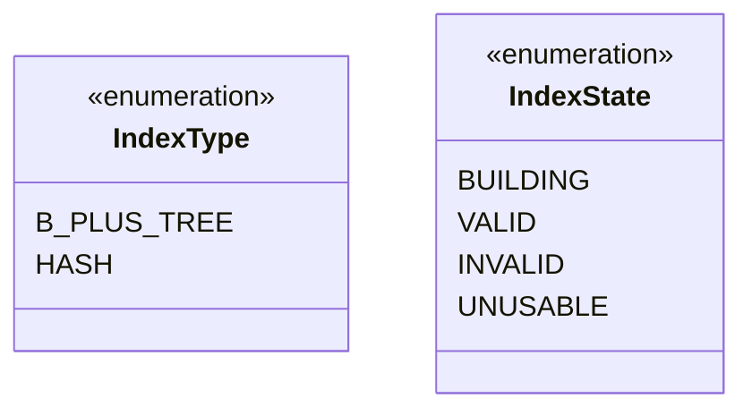
*   **What is its role?** 
    *   `IndexType`: Identifies the index algorithm (B+ Tree or Hash Index). Supports future scalability of the DBMS.
    *   `IndexState`: A State Machine managing the safe lifecycle of the index.
*   **Why design it this way?**
    *   If it is in the `BUILDING` state (during bulk_load) or `INVALID` (broken tree links), the system must immediately reject all queries (SELECT, INSERT) to avoid corrupting or misreading the source data. Enums help the system branch (if-else) 100% accurately without worrying about typos.
*   **Example:** Upon calling `CREATE INDEX`, the metadata variable will be assigned `state = IndexState.VALID` after successful initialization.

### 2. `NodeType` & `LatchMode` & `ScanDirection`
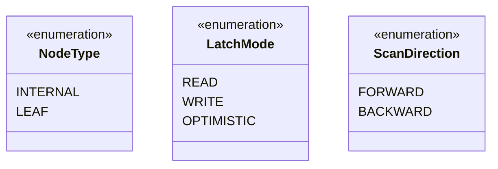
*   **What is its role?**
    *   `NodeType`: Distinguishes between Internal nodes and Leaf nodes.
    *   `LatchMode`: Multithreaded lock modes (Read Lock - shared by many, Write Lock - exclusive).
    *   `ScanDirection`: Iteration direction of the Iterator (Forward or Backward).
*   **Why design it this way?** These variables are often passed as parameters (`direction`, `mode`). If using a boolean variable like `is_forward=True`, code readers won't understand if `True` means forward or backward. Using the Enum `ScanDirection.FORWARD` provides absolute self-documenting clarity.

---

## PART 2: DATA ENTITIES & STRUCTURES

### 3. `RecordID` (Record Coordinates)
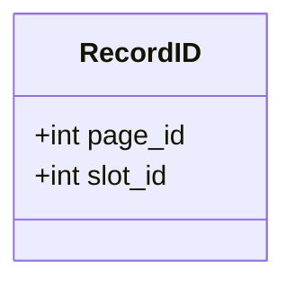
*   **What does this class do?** Points directly to the actual data residing physically on the hard disk.
*   **Attribute & Data Type Analysis:**
    *   `page_id (int)`: The ID of the page storing data (Heap file page). The `int` type is mandatory because of its compact size (4 bytes) and CPUs process integer lookups fastest.
    *   `slot_id (int)`: The row index inside that page.
*   **Example:** When finding a record with `RecordID(page_id=20, slot_id=3)`, the DB will read page 20, access the 3rd row offset, and return it to the client.

### 4. `IndexEntry` (Leaf Element)
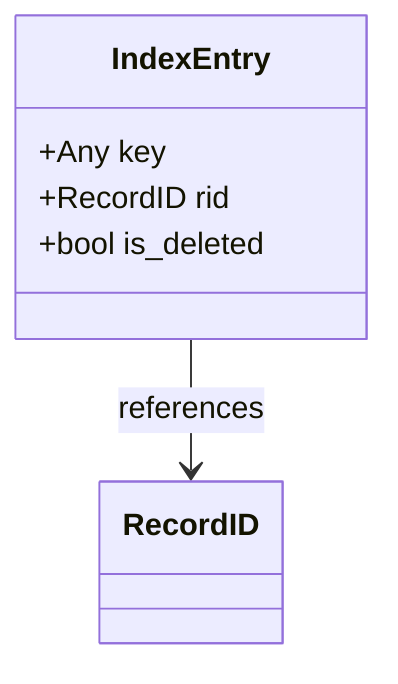
*   **What does this class do?** This is the smallest data building block located in the Leaf node arrays. Connects the Key with the Record Coordinates.
*   **Attribute & Data Type Analysis:**
    *   `key (Any)`: The key can be a number, string, boolean... Should use `Any` or Generic.
    *   `rid (RecordID)`: Record coordinates on the hard drive.
    *   `is_deleted (bool)`: Flag indicating **Logical Deletion (Tombstone)**. Instead of costly array shifting, the algorithm just toggles `is_deleted = True`. It will be ignored during `point_search`.
*   **Example:** A user runs `DELETE FROM Users WHERE age = 30`. The record for age 30 will have its state changed to `is_deleted = True` instead of being removed from the physical array immediately.

### 5. `NodeHeader` (Node Header)
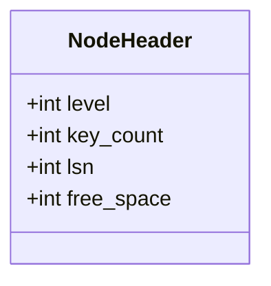
*   **What does this class do?** The header located at the first bytes of each Node, containing the Metadata of that page.
*   **Attribute Analysis:**
    *   `level (int)`: The level of the Node. Leaves always have level = 0.
    *   `lsn (int - Log Sequence Number)`: The "version" of the Node. When a thread inserts data, lsn increments by 1. This is crucial for Optimistic Reads to know if a node was stealthily modified to decide whether to re-read.

### 6. `IndexMetadata` (Index Metadata)
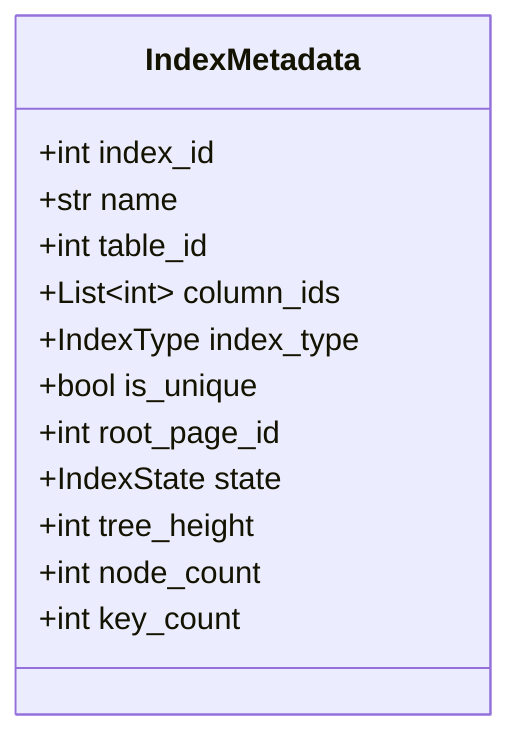
*   **What does this class do?** Contains the configuration and global statistics of an index.
*   **Why is this class needed?** Instead of passing 11 scattered parameters into `create_index`, we encapsulate them into a Parameter Object for easier maintenance. Attributes like `tree_height` and `key_count` assist the Query Optimizer in predicting query costs.

---

## PART 3: TREE GRAPH STRUCTURE (TREE NODES)

### 7. `BTreeNode` (Base Node)
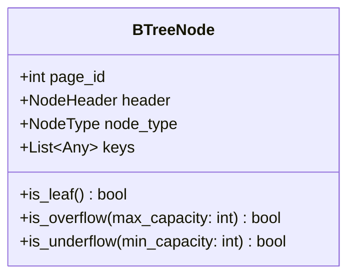
*   **What does this class do?** The abstract parent class. Provides common attributes for Leaf and Internal nodes.
*   **Method Analysis:**
    *   `is_overflow()` / `is_underflow()`: Returns a `bool` indicating if the page exceeds the threshold (needs Split) or falls below the minimum (needs Merge).

### 8. `InternalNode` & `LeafNode`
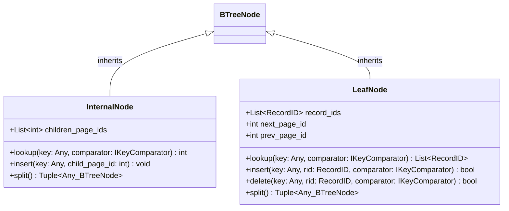
*   **What do these classes do?**
    *   `InternalNode`: Acts as "Traffic Signs" (Routing). Only contains routing keys and `children_page_ids` (pointers to child page IDs).
    *   `LeafNode`: Contains the actual data (`record_ids`). Manages `next_page_id`, `prev_page_id` pointers forming a Doubly Linked List.
*   **Method Analysis (Polymorphism):**
    *   The `lookup()` function of an Internal node outputs a child page ID (`int`), while `lookup()` of a Leaf node outputs an array of row addresses (`List<RecordID>`).
*   **Why design next/prev arrays at Leaf?** Without horizontal links, every time you scan 10 million rows, you'd have to traverse down from the Root 10 million times, crashing the CPU. With horizontal pointers, the system traverses from the Root once, then jumps sideways back and forth between Leaves (O(1) speed).

---

## PART 4: ABSTRACT INTERFACE LAYER

### 9. Administration & Access Interfaces (`IIndexLifecycleManager` & `IIndexAccessMethod`)
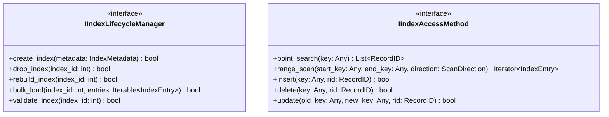
*   **What do these interfaces do?** 
    *   `IIndexLifecycleManager`: For the system (DDL). Manages flagging drops (`drop_index`), structural validation (`validate_index`), loading from backups (`bulk_load`).
    *   `IIndexAccessMethod`: For end-users and Optimizer (DML). Acts as a Facade gateway receiving read/write commands.
*   **Why design it?** (Explained in Part 1 - Dependency Inversion & Facade Pattern).

### 10. B+ Tree Engine & Utilities Interfaces (`IBTreeEngine` & `IKeyComparator` & `IIndexConcurrencyManager` & `IIndexMaintenance`)
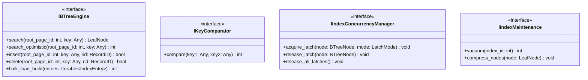
*   **What do these interfaces do?**
    *   `IBTreeEngine`: Contract for the core software (Core Engine).
    *   `IKeyComparator`: Contract for the router (Greater/Less/Equal).
    *   `IIndexConcurrencyManager`: Contract for Lock control.
    *   `IIndexMaintenance`: Contract for the maintenance Worker.
*   **Why design Interfaces?** 
    *   Easy Mocking: While testing `BTreeAccessMethod`, we can create a `MockBTreeEngine` to mock data outputs. 
    *   OCP Principle (Extensibility): Allows plugging in a new `compress_nodes` algorithm for `IIndexMaintenance` without modifying old code.

---

## PART 5: ALGORITHM IMPLEMENTATION CLASSES

### 11. High-Level Structure Classes
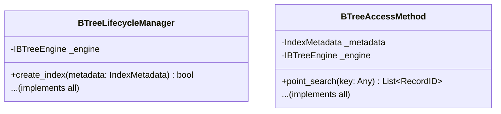
*   **What do these classes do?** Implements the 2 high-level interfaces.
*   **Linkage Flow:** Hard dependency on `IndexMetadata` (to check if the index state is `VALID` before working) and `IBTreeEngine` (to pass commands down for the tree engine to process).
*   **Method Example:** The `point_search(key)` function will run `if self._metadata.state != VALID: throw Error`. Then call `leaf = self._engine.search(root, key)`. 

### 12. The Heart of the System (`BTreeEngine`)
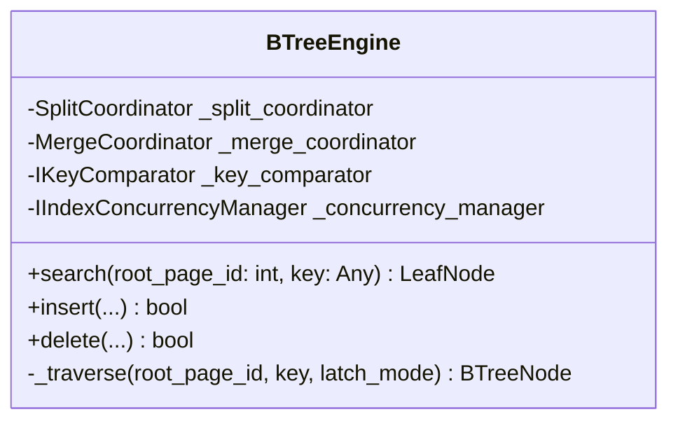
*   **What does this class do?** Contains all core algorithms (Tree Traversal, Node Insertion, Page Tearing).
*   **Linkage Flow (Delegation):** It DOES NOT WRITE Split or Merge code spanning thousands of lines. It delegates (Delegation) to 2 classes: `SplitCoordinator` and `MergeCoordinator`.
*   **Why use Delegation design?** Single Responsibility Principle. Engine only handles routing. Structure mending is handled by others.
*   **`_traverse` Method Analysis:** `_traverse` iterates recursively. During each step, it calls `_concurrency_manager` to request a Latch on the child page, then releases the Latch on the parent page (Crabbing technique). If it detects an error (e.g., LSN changed silently), it automatically restarts.

### 13. Coordinators
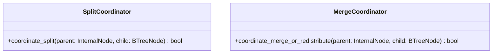
*   **What do these classes do?**
    *   `SplitCoordinator`: Responsible for splitting the data array in half when a page Overflows, creating a new page, and pushing the median key up to the Parent page. Returns a `bool` flag reporting structure stability.
    *   `MergeCoordinator`: When a page Underflows (element count < min_capacity), it borrows (Redistribute) a key from a neighbor page. If the neighbor is also depleted, it Merges 2 pages into 1. Pulls down the routing key from the Parent.

### 14. Special Utility Classes (`RangeIterator`, `TypeAwareKeyComparator`, `LockCrabbingManager`, `IndexVacuumWorker`)
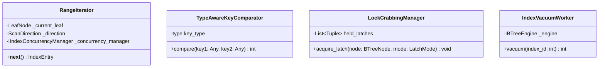
*   **Role Analysis and Design:**
    *   `RangeIterator`: Applies the **Iterator Pattern**. Provides a `__next__()` function returning each `IndexEntry`. Maintains state variables (`_current_leaf`, `_direction`). Connects directly to `IIndexConcurrencyManager` because when jumping to a new Leaf, it needs to Lock that new Leaf to prevent others from deleting it while reading.
    *   `TypeAwareKeyComparator`: Applies the **Strategy Pattern**. Recognizes if the passed variable is a String or Integer to use the appropriate comparison algorithm. Returns `[-1, 0, 1]`.
    *   `LockCrabbingManager`: Manages the `held_latches` list (locks currently held). Supports shared (`READ`) and exclusive (`WRITE`) locks. Protects the B+ Tree from Race Conditions.
    *   `IndexVacuumWorker`: Background garbage collector. When the system is idle, the Worker runs the `vacuum()` function. It scans the entire `record_ids` array of Leaves, physically extracts completely `IndexEntry` objects with `is_deleted = True` from the hard disk, and releases back `free_space` into the `NodeHeader`. Restores disk performance. Returns an `int` which is the amount of capacity recovered.
