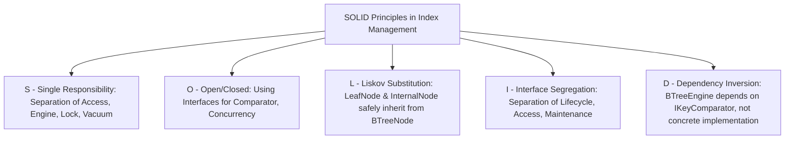
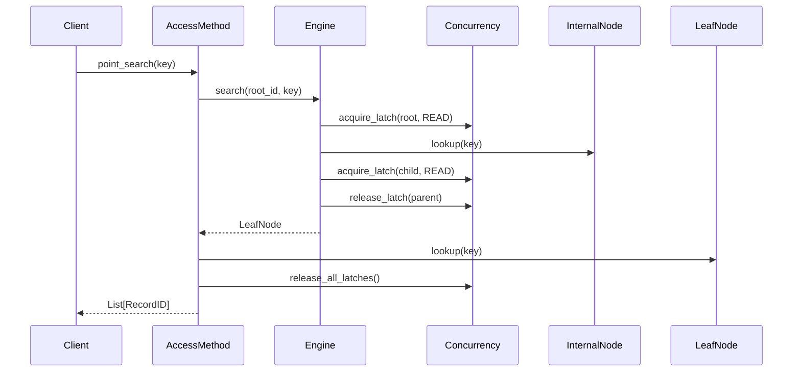

# Comprehensive Guide to DBMS Index Management (B+ Tree Index)

This document aggregates all knowledge, design architecture, design patterns, SOLID analysis, module structures, and detailed logic of the 8 business flows in the **DBMS Index Management** subsystem using a B+ Tree structure.

---

## PART 1: SYSTEM OVERVIEW

### 1.1 Concept of DBMS Index Management
An index is an auxiliary data structure built on top of the main data table to accelerate the speed of finding records without having to scan the entire table (Table Scan). The Index Management subsystem is responsible for creating, storing, maintaining structural integrity, and freeing the index when data in the main table changes (Insert, Update, Delete).

### 1.2 Why choose B+ Tree?
B+ Tree is the industry-standard data structure for disk-based indexes in relational database management systems (RDBMS) thanks to the following characteristics:
1.  **High Fan-out:** Each internal node page can hold hundreds of routing keys, keeping the tree height low (usually only 3 to 4 levels), reducing the number of disk I/O reads.
2.  **Excellent Range Scan Support:** Leaf Nodes are doubly linked together into a doubly linked list (`next_page_id`, `prev_page_id`). As a result, range scanning only requires finding the first leaf node, then sequentially iterating through sibling pages without backtracking to the parent node.
3.  **All Data Resides in Leaf Nodes:** Internal nodes only contain routing keys and child page IDs. This optimizes the Buffer Pool capacity and ensures the point search time is constant (O(log N)) because every path from root to leaf has the same length.

---

## PART 2: SOLID OOP ARCHITECTURE & DESIGN PATTERNS

The system is designed strictly adhering to SOLID principles and applying 4 main design patterns to enhance maintainability, extensibility, and testability:



### 2.1 Four Core Design Patterns
1.  **Facade Pattern:**
    *   *Applied Class:* `BTreeAccessMethod`.
    *   *Description:* The Client only calls simple APIs like `point_search`, `range_scan`, `insert`, `delete` without caring about page latches, node splitting, or borrowing keys.
2.  **Strategy Pattern (Key Comparison Algorithm):**
    *   *Applied Class:* `IKeyComparator`, `TypeAwareKeyComparator`.
    *   *Description:* The B+ Tree Engine is entirely independent of the key data type. The specific key comparison algorithm (integer, string, date) is encapsulated into different comparison strategies injected into the Engine at runtime.
3.  **Iterator Pattern:**
    *   *Applied Class:* `RangeIterator`.
    *   *Description:* When scanning a range, the system returns an iterator for the client to pull each record as needed. This iterator is responsible for automatically acquiring read latches on the next leaf page and releasing the old leaf page when navigating via sibling links.
4.  **Coordinator / Mediator Pattern:**
    *   *Applied Class:* `SplitCoordinator`, `MergeRedistributeManager`.
    *   *Description:* Coordinates splitting and merging/redistributing when nodes overflow or underflow. Separating this logic from the page data class keeps the code clean and reduces cross-coupling.

---

## PART 3: DETAILED STRUCTURE OF EACH MODULE IN `src/`

The source code is organized into a `src/` package with a structure equivalent to the grouping on the Mind Map Diagram:

### 3.1 `enums.py` (Common Types & Exceptions)
Defines constants, enumerations, and exception classes shared across the project:
*   `NodeType`: Defines if the page is `LEAF` or `INTERNAL`.
*   `IndexType`: Supports extension to `B_PLUS_TREE`, `HASH`.
*   `IndexState`: The operational states of the index (`BUILDING`, `VALID`, `INVALID`, `UNUSABLE`).
*   `LatchMode`: Latch modes on pages (`READ`, `WRITE`, `OPTIMISTIC`).
*   `ScanDirection`: Scan direction for the Iterator (`FORWARD`, `BACKWARD`).
*   `IndexUnusableException` / `DuplicateKeyException`: Business exceptions.

### 3.2 `metadata.py` (Index Metadata Management)
Manages metadata describing the index:
*   `IndexMetadata`: Stores index identifier (`index_id`, `name`), applicable table and columns, unique property (`is_unique`), root page address (`root_page_id`), current state (`state`), and tree statistical parameters (height, node count, key count).

### 3.3 `node_layout.py` (Node Layout Management)
Defines the physical layout of index pages in memory:
*   `RecordID`: Stores the record address comprising `page_id` and `slot_id`.
*   `IndexEntry`: The key and RecordID pair (`key`, `rid`) along with the logical deletion flag `is_deleted`.
*   `NodeHeader`: The page header containing `level` (0 is leaf), `key_count` (number of keys), `lsn` (page log sequence number), `free_space` (free capacity to check overflow), and `version` (version number for optimistic read).
*   `BTreeNode`: The base class providing utility functions for checking overflow `is_overflow()` and underflow `is_underflow()`.
*   `InternalNode`: Internal node page. Contains a `keys` array and a `children_page_ids` pointer array. Implements binary search `lookup()` to route searches.
*   `LeafNode`: Leaf node page. Contains a list of records `entries`. Provides `next_page_id` and `prev_page_id` pointers to adjacent sibling pages.

### 3.4 `key_evaluator.py` (Key Evaluator & Key Compressor)
*   `IKeyComparator`: Standard interface for comparisons.
*   `TypeAwareKeyComparator`: Implements dynamic comparisons based on registered data types (`int`, `str`...), ensuring type safety by raising a `TypeError` if inputs are mismatched.

### 3.5 `tree_operations.py` (B+Tree Core Engine & Coordinators)
The heart of the B+ Tree algorithm:
*   `BTreeEngine`: Responsible for allocating pages (`allocate_leaf`, `allocate_internal`), traversing the tree (`_traverse`), finding keys, and calling structural reorganization coordinators.
*   `SplitCoordinator`: Handles when a leaf or internal page exceeds the maximum allowed keys (`max_capacity`). It splits the data in half and pushes the median key to the parent page.
*   `MergeRedistributeManager`: Handles when a leaf page suffers an underflow (`min_capacity`). It borrows keys from an adjacent sibling (Redistribution) or merges two leaf pages into one (Merge) and deletes the key from the parent page.

### 3.6 `concurrency_control.py` (Concurrency Control Manager)
*   `LockCrabbingManager`: Implements the **Latch Crabbing / Latching Coupling** protocol. While moving down the tree, a thread must acquire the latch on the child node before releasing the latch on the parent node. Ensures the elimination of race conditions between reader and writer threads.

### 3.7 `access_methods.py` (Index API / Access Methods)
Facade providing a single gateway for the Client:
*   `BTreeAccessMethod`: Receives point search `point_search()`, range scan `range_scan()`, insert `insert()`, delete `delete()`, and update `update()` requests. It verifies the validity of the index state before delegating to the Engine.

### 3.8 `lifecycle_manager.py` (Index LifeCycle Manager)
Manages the administrative lifecycle of the tree:
*   `BTreeLifecycleManager`: Provides `create_index()`, `drop_index()` (marks index as deleted), `rebuild_index()`, `bulk_load()`, and `validate_index()` functions.

### 3.9 `maintenance_garbage_collection.py` (Index Maintenance & GC)
*   `IndexVacuumWorker`: Executes background cleanup processes to physically release records marked for logical deletion (Tombstones) to reclaim free space on leaf pages, while simultaneously simulating a Prefix Compression mechanism to optimize space.

---

## PART 4: DETAILED LOGIC OF 8 BUSINESS FLOWS

### 4.1 Flow 1: Point Search


1.  **Tree Traversal:** Starts from the root page (`root_page_id`). Acquires read latch on the root page.
2.  **Routing:** If the node is an internal node, it uses `lookup()` to find the child page to branch to.
3.  **Latch Crabbing:** Acquires read latch on the child page, then releases the read latch on the parent page. Repeats until reaching a leaf page.
4.  **Querying:** Searches for a matching key on the leaf page. Ignores records with the `is_deleted = True` flag. Releases all latches and returns a list of `RecordID`s.

### 4.2 Flow 2: Range Scan
1.  **Find the Range Start:** Traverses the tree to find the leaf page containing the smallest key that is greater than or equal to `start_key`.
2.  **Initialize Iterator:** Returns a `RangeIterator` object holding a read latch on that starting leaf page.
3.  **Sequential Traversal (__next__):**
    *   Retrieves valid keys on the current leaf page until exceeding `end_key` or exhausting the page.
    *   If the current page is exhausted, read-latches the sibling page (`next_page_id`), releases the read latch on the old page, and continues the loop.
    *   Raises `StopIteration` when encountering a key greater than `end_key` or there are no more sibling pages (`next_page_id == -1`).

### 4.3 Flow 3: Insert & Split
1.  **Traverse and Insert:** Finds the appropriate leaf page for the new key. Acquires a `WRITE` latch on the leaf page and inserts data.
2.  **Overflow Check:** If the number of keys exceeds `max_capacity`:
    *   Allocates a new sibling leaf page.
    *   Moves 50% of the records to the new page.
    *   Updates the horizontal link pointers (`next_page_id`, `prev_page_id`).
3.  **Propagate Upwards:** Calls `SplitCoordinator` to push the median key to the parent node. If the parent node also overflows, the splitting process continues recursively upwards. If the root page splits, it creates a new root page (internal node) and the tree height increases by 1.

### 4.4 Flow 4: Delete & Merge/Redistribute
1.  **Find and Logical Delete:** Finds the leaf page containing the key to be deleted. Sets the `is_deleted = True` flag on the `IndexEntry`.
2.  **Underflow Check:** If the number of valid keys drops below `min_capacity`, activates `MergeRedistributeManager`:
    *   **Borrow Key (Redistribution):** If an adjacent sibling page has more keys than `min_capacity`, it moves a boundary key from the sibling page to the current page. Updates the separating key at the parent page.
    *   **Merge Pages (Merge):** If the sibling page is also starved of keys, it merges all data from the current page to the sibling page. Frees the empty page and deletes the corresponding separating key on the parent page.

### 4.5 Flow 5: Optimistic Read
1.  **Read Initial Version:** Retrieves the `version` number from the page header without acquiring a read latch.
2.  **Access Data:** Reads the routing key or page contents.
3.  **Re-validate:** Re-reads the version number of the page.
    *   If `version_before == version_after`: The read data is consistent. Completes the read.
    *   If `version_before != version_after`: An intervening write thread has modified the page. Automatically falls back to physically acquiring a `READ` latch and re-reads.

### 4.6 Flow 6: Bulk Loading
1.  **Sort:** Sorts the entire input `IndexEntry` array in ascending key order.
2.  **Bottom-up Build:** Allocates leaf pages and populates data sequentially from left to right. When a page is full, it creates a new leaf page and pushes the separating key upwards.
3.  *Benefits:* Avoids the cost of single insertions (multiple tree traversals) and limits page fragmentation (every leaf page is packed to 100% of its designed capacity).

### 4.7 Flow 7: Vacuum Maintenance (Vacuum & Compaction)
1.  **Page Scan:** Periodically scans through the leaf pages of the index tree.
2.  **Physical Cleanup:** Completely removes `IndexEntry` objects with `is_deleted == True` from the list to reclaim physical free bytes.
3.  **Compaction:** Executes Prefix Compaction to increase the available memory (`free_space`) on the page.

### 4.8 Flow 8: Rebuild & Validation
1.  **Validation:** Traverses the entire index tree and checks:
    *   Ordering relationship: The key at position `i` must be less than or equal to the key at position `i+1`.
    *   Pointer consistency: Horizontal links between leaf pages must be symmetric (if `A.next == B`, then `B.prev == A`).
2.  **Rebuild:** If validation fails or the tree is highly fragmented, it locks the entire index, frees old pages, scans the main table, and Bulk Loads a new index tree from scratch.

---

## PART 5: SYSTEM TESTING

The project is safeguarded by an automated testing system consisting of 3 layers of cross-checks:

1.  **Doctests (14 tests):** Embedded directly into the `src/` source code to directly test the raw APIs of small functions.
2.  **Unit Tests (10 tests):** Runs entity classes in isolation to ensure no fundamental mathematical logic errors occur.
3.  **Integration Tests (8 tests):** Simulates the 8 major business flows cross-connecting modules.

You can run all 32 test cases with a single command:
```bash
python -m pytest tests/
```
The test report will be formatted clearly to show the progress of each TestCase.
